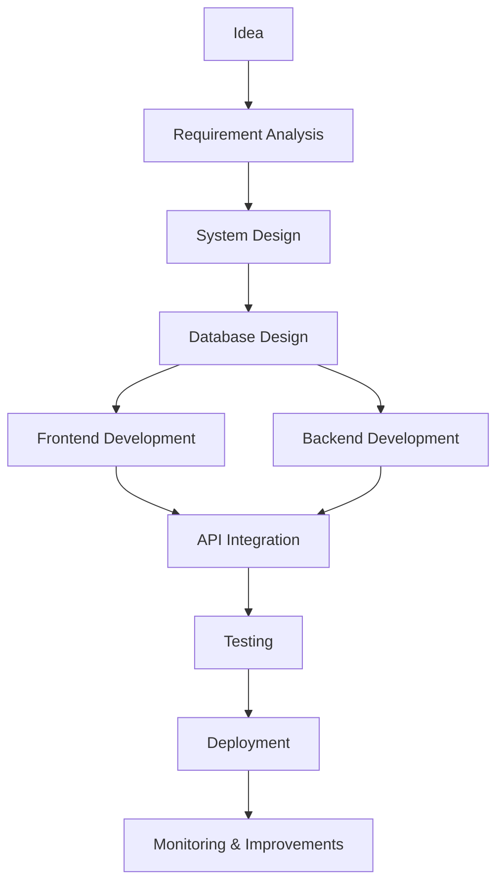

<!-- Premium GitHub Profile README for Mohd Anas -->

<div align="center">


</div>

<div align="center">


</div>

<br />

<div align="center">


</div>

---

## 👨‍💻 About Me

Hi, I’m **Mohd Anas**, a passionate **Full Stack Developer** focused on building scalable, high-performance, and production-ready digital products.

I enjoy creating modern web applications, SaaS platforms, admin dashboards, backend APIs, cloud-ready systems, and AI-powered features that solve real business problems.

```txt
Developer Type   : Full Stack Developer
Focus Area       : SaaS, AI Integration, Web Applications, Cloud & DevOps
Mindset          : Clean Architecture, Performance, Scalability
Goal             : Build real-world products that create business value
````

* 🔭 Currently working on **GPS CRM, AI-powered web applications, and modern full-stack projects**
* 🌱 Currently learning **Advanced System Design, Cloud Deployment, Docker, Kubernetes, and AI Integration**
* 👯 Open to collaborate on **Open Source, SaaS, AI, and Full Stack Development projects**
* 🤝 Looking to improve in **Cloud Architecture, System Design, and Open Source contributions**
* 👨‍💻 Portfolio: **[mohdanas.co.in](https://www.mohdanas.co.in)**
* 💬 Ask me about **Full Stack Development, Docker, Cloud, APIs, AI Integration, and System Design**
* 📫 Reach me at **[mohammadanas11110@gmail.com](mailto:mohammadanas11110@gmail.com)**
* ⚡ Fun fact: **Every great application starts with clean architecture**

---

## 🌐 Connect With Me

<div align="center">

<a href="https://www.mohdanas.co.in" target="_blank">
  
</a>

<a href="mailto:mohammadanas11110@gmail.com">
  
</a>

<a href="https://github.com/anasm0778" target="_blank">
  
</a>

<a href="https://www.linkedin.com" target="_blank">
  
</a>

</div>

---

## 🧠 What I Do

<div align="center">

| 🚀 Area                  | 💡 What I Build                                                           |
| ------------------------ | ------------------------------------------------------------------------- |
| **Frontend Development** | Modern, responsive, fast, and user-friendly interfaces                    |
| **Backend Development**  | Secure APIs, authentication, business logic, and clean architecture       |
| **SaaS Applications**    | Dashboards, admin panels, subscription-based systems, and business tools  |
| **AI Integration**       | AI chatbots, automation, smart workflows, and AI-powered features         |
| **Cloud & DevOps**       | Docker-based deployment, server setup, CI/CD, and production environments |
| **Database Design**      | Relational and NoSQL database structure, optimization, and integrations   |

</div>

---

## 🛠️ Tech Stack

<div align="center">

### 💻 Programming Languages


### 🎨 Frontend Development


### ⚙️ Backend Development


### 🗄️ Databases


### ☁️ Cloud, DevOps & Deployment


### 🤖 AI, Data & Mobile


### 🧰 Developer Tools


</div>

---

## 🚀 Current Focus

```txt
Full Stack Development      ████████████████████  100%
Frontend Engineering        ███████████████████░   95%
Backend Development         ███████████████████░   95%
Database Design             ██████████████████░░   90%
Docker & Deployment         █████████████████░░░   85%
AI Integration              ████████████████░░░░   80%
System Design               ███████████████░░░░░   75%
Kubernetes                  ████████████░░░░░░░░   60%
```

---

## 💼 Featured Work

<div align="center">

| Project Type            | Description                                                  | Tech Focus                  |
| ----------------------- | ------------------------------------------------------------ | --------------------------- |
| **GPS CRM**             | CRM platform for business operations and customer management | Full Stack, Dashboard, APIs |
| **AI Web Applications** | AI-powered tools with smart workflows and automation         | AI Integration, Backend, UI |
| **SaaS Platforms**      | Scalable business applications with admin panels             | SaaS, Cloud, Database       |
| **Modern Web Apps**     | Responsive and performance-focused websites                  | React, Next.js, Tailwind    |
| **Backend Systems**     | Secure APIs and business logic architecture                  | .NET, Node.js, Python       |
| **Cloud Deployments**   | Production-ready deployment and server setup                 | Docker, Linux, Nginx        |

</div>

---

## 🧩 My Development Workflow



---

## 🏆 GitHub Trophies

<div align="center">


</div>

---

## 📊 GitHub Analytics

<div align="center">


</div>

<br />

<div align="center">


</div>

---

## 📈 Contribution Graph

<div align="center">


</div>

---

## 🎯 Professional Strengths

<div align="center">

| Strength               | Details                                                          |
| ---------------------- | ---------------------------------------------------------------- |
| **Clean Architecture** | I prefer building maintainable and scalable code structures      |
| **Problem Solving**    | I enjoy breaking complex problems into simple solutions          |
| **UI/UX Sense**        | I focus on clean, modern, and usable interfaces                  |
| **Backend Logic**      | I like building secure and reliable backend systems              |
| **Production Mindset** | I think beyond local development and focus on real deployment    |
| **Learning Attitude**  | I continuously improve my skills in cloud, AI, and system design |

</div>

---

## 🔥 Developer Mindset

```txt
Clean Code          → Better Maintainability
Strong Architecture → Better Scalability
Modern UI/UX        → Better User Experience
Secure Backend      → Better Reliability
Cloud Deployment    → Better Availability
AI Integration      → Smarter Products
Continuous Learning → Long-Term Growth
```

---

## ✨ Quote I Believe In

<div align="center">

### “Every great application starts with clean architecture.”

</div>

---

## 🐍 Contribution Snake

<div align="center">


</div>


---

<div align="center">


</div> 
